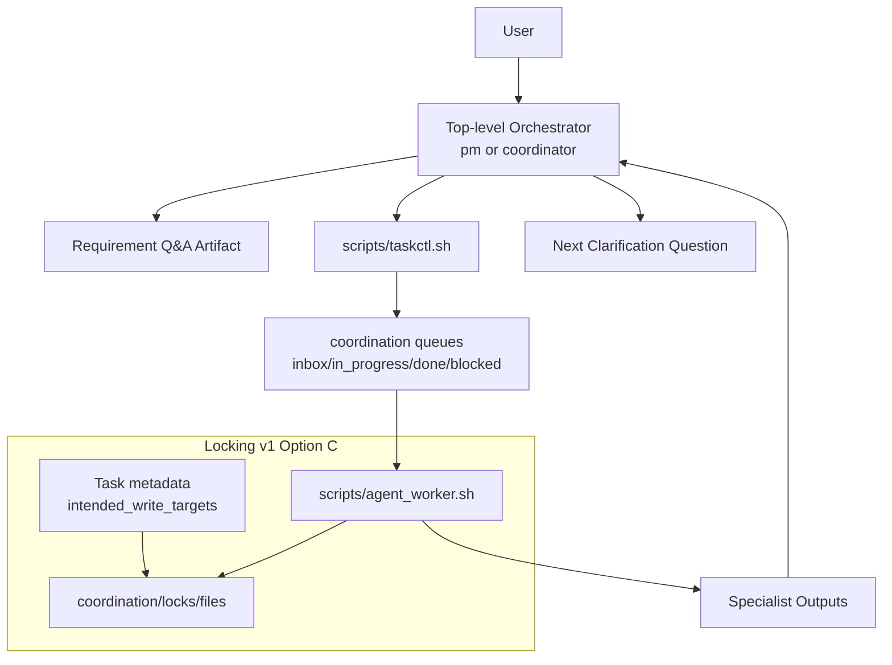

> Archival note: This spec package records the pre-extraction in-repo coordinator model. The authoritative coordinator implementation now lives in the standalone `/workspace/coordinator` repository.

# Design: Top-Level Orchestrator Requirement Clarification Parity with Ralph Plan

## Overview
This design upgrades the repository's top-level orchestration behavior so requirement clarification quality matches `ralph plan` style while preserving the existing coordination workflow. The orchestrator remains execution-focused (task creation, delegation, monitoring, synthesis), but gains a strict clarification protocol and conflict-safe multi-agent planning through Option C locking.

Primary outcome:
- The top-level orchestrator continuously produces high-quality specialist task plans during clarification.
- Specialist findings feed into new user clarification questions.
- File write race conditions are prevented across agents.

## Detailed Requirements
1. Clarification rigor parity:
- Top-level orchestrator must behave like `ralph plan` for requirement elicitation depth.
- It must ask one question at a time.
- It must require explicit user confirmation before changing major phases.

2. Continuous planning outputs:
- Non-negotiable output is planned tasks for specialist subagents using this repo's coordination folder model.
- Task creation/delegation happens continuously during clarification, not only after clarification ends.

3. Specialist feedback loop:
- Orchestrator must use specialist outputs to identify new details, requirements, and follow-up user clarification questions.

4. Dynamic delegation model:
- Orchestrator may delegate to any necessary specialist and may create new specialists when useful.

5. Guardrails:
- Only mandatory guardrail is prevention of race conditions where agents modify the same files.
- Selected v1 model: Option C (per-task ownership declarations + mandatory per-file write-time locking).

6. Clarification completion condition:
- Clarification ends only when user explicitly confirms requirements are complete and there are no open blocker tasks.

## Architecture Overview


System behavior split:
1. Clarification protocol layer (prompt/instructions): strict one-question loop and phase gates.
2. Delegation/execution layer (existing taskctl/workers): ongoing specialist planning/execution.
3. Concurrency safety layer (new): ownership declarations + write-time file locks.

## Components and Interfaces
1. Top-level orchestration prompt contract (`coordination/prompts/TOP_LEVEL_AGENT_PROMPT.md`)
- Add explicit clarification loop rules:
  - exactly one user-facing requirement question per turn,
  - record answer before next question,
  - do not batch multiple questions.
- Add clarification exit gate:
  - explicit user completion confirmation,
  - no unresolved blocker tasks.
- Add specialist-feedback requirement:
  - each specialist result must produce either a requirement refinement or a new user question.

2. Coordinator operating contract (`coordination/COORDINATOR_INSTRUCTIONS.md`)
- Replace one-pass input collection with staged iterative elicitation.
- Preserve existing responsibilities for delegation and blocker resolution.

3. Task schema (`coordination/templates/TASK_TEMPLATE.md`)
- Extend frontmatter with lock-relevant metadata:
  - `intended_write_targets: []`
  - `lock_scope: file`
  - `lock_policy: block_on_conflict`
- For non-writing tasks, `intended_write_targets` may remain empty.

4. Task control CLI (`scripts/taskctl.sh`)
- Add validation and helper behavior:
  - ensure writing tasks declare `intended_write_targets`,
  - expose lock diagnostics/reaping commands,
  - preserve current done/block semantics and blocker report generation.

5. Worker loop (`scripts/agent_worker.sh`)
- Enforce write-time lock acquisition before file modification.
- On lock conflict, block task with clear reason.
- Release locks on task completion/failure.
- Maintain heartbeat timestamps for stale lock detection.

6. Lock store (`coordination/locks/files/`)
- File-based locks keyed by canonical path hash.
- Lock payload fields:
  - `task_id`,
  - `owner_agent`,
  - `canonical_target`,
  - `acquired_at`,
  - `heartbeat_at`.

## Data Models
1. Task metadata model (frontmatter extension)
```yaml
id: TASK-1234
owner_agent: fe
creator_agent: coordinator
status: inbox
priority: 30
intended_write_targets:
  - src/api/profile.ts
  - src/contracts/profile.json
lock_scope: file
lock_policy: block_on_conflict
```

2. Lock file model (example JSON payload)
```json
{
  "task_id": "TASK-1234",
  "owner_agent": "fe",
  "canonical_target": "src/api/profile.ts",
  "acquired_at": "2026-02-20T13:00:00+0000",
  "heartbeat_at": "2026-02-20T13:02:00+0000"
}
```

3. Clarification state model (conceptual)
- `current_phase`: `clarification | planning | execution | closeout`
- `pending_question`: one active question at a time
- `requirements_complete_user_confirmed`: boolean
- `open_blocker_count`: integer

## Error Handling
1. Clarification protocol violations
- Condition: orchestrator asks multiple questions in one turn or advances phase without confirmation.
- Handling: prompt contract marks this as non-compliant behavior and requires immediate correction in next turn.

2. Missing write-target declarations
- Condition: coding task lacks `intended_write_targets`.
- Handling: task creation/delegation fails fast with actionable error.

3. Lock conflict
- Condition: another task currently holds lock for target file.
- Handling: worker blocks task via `taskctl.sh block` with lock conflict reason; blocker report routes to creator agent.

4. Stale lock
- Condition: lock heartbeat older than TTL.
- Handling: coordinator or orchestrator reaps lock with audit note, then task may be retried.

5. Worker crash while lock held
- Condition: task exits unexpectedly.
- Handling: lock cleanup on failure path where possible; stale lock sweeper handles residue.

## Acceptance Criteria
1. Clarification protocol
- Given a new ambiguous request
- When top-level orchestrator starts clarification
- Then it asks exactly one requirement question per user-facing turn.

2. Phase transition gate
- Given clarification is ongoing
- When user has not explicitly confirmed completion
- Then orchestrator does not transition to design/planning finalization.

3. Continuous specialist planning
- Given clarification reveals uncertain technical details
- When orchestrator identifies investigation need
- Then it creates/delegates specialist tasks during clarification.

4. Specialist feedback integration
- Given a specialist task completes with new constraints or options
- When orchestrator processes that result
- Then it either updates requirements or asks one new targeted user clarification question.

5. Clarification completion rule
- Given user states requirements are complete
- When blocker tasks still exist
- Then orchestrator does not finalize clarification.

6. Lock conflict prevention
- Given two tasks intend to modify the same file
- When second task attempts write-time lock acquisition
- Then it fails acquisition and transitions to blocked with lock conflict reason.

7. Lock cleanup
- Given a task finishes done or blocked
- When lock lifecycle ends
- Then all locks held by that task are released or marked stale for reap.

## Testing Strategy
1. Prompt behavior tests
- Static contract tests for prompt text patterns:
  - one-question rule present,
  - explicit phase-gate rule present,
  - specialist-feedback loop requirement present.

2. Task schema tests
- Validate new frontmatter fields parse correctly from template-generated tasks.
- Validate missing `intended_write_targets` for writing tasks is rejected.

3. Locking unit/integration tests
- Acquire lock success path for unique file.
- Acquire lock conflict path across two tasks.
- Same-task reentrant write permission behavior (if allowed) or explicit rejection behavior.
- Lock release on done/block transitions.
- Stale lock reap behavior after TTL.

4. Workflow simulation tests
- Simulate clarification loop with parallel specialist tasks and blocker reports.
- Verify orchestrator remains in clarification until user confirms and blockers are clear.

## Appendices
### Technology Choices
1. Continue file-based coordination under `coordination/`.
2. Implement lock persistence as file payloads in `coordination/locks/files/` for inspectability and low operational overhead.
3. Reuse existing blocker escalation path (`taskctl.sh block` + auto priority-000 reports).

### Research Findings Summary
1. Current top-level prompt already defines orchestration loop but lacks strict single-question protocol.
2. Coordinator instruction currently biases one-pass data collection, conflicting with iterative elicitation.
3. Existing task and worker scripts provide strong lifecycle primitives and blocker escalation.
4. No current file race-prevention mechanism exists; Option C provides balanced safety and complexity.

### Alternative Approaches Considered
1. Option A (always per-file lock only): strongest safety, higher operational friction.
2. Option B (declaration-only ownership): simplest, weaker runtime guarantees.
3. Git-branch isolation per agent: stronger isolation but higher merge/arbitration complexity than needed for v1.
