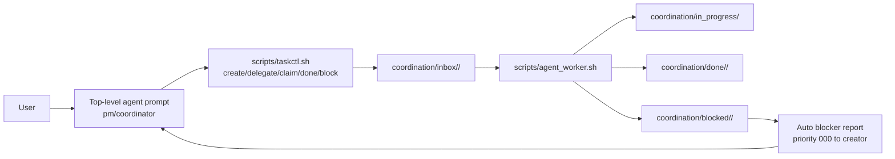

> Archival note: This spec package records the pre-extraction in-repo coordinator model. The authoritative coordinator implementation now lives in the standalone `/workspace/coordinator` repository.

# Research 01: Current Orchestrator Flow

## Objective
Map the current top-level orchestration flow and identify why requirement clarification quality is inconsistent.

## Observed Flow (Current)

## Findings
1. The top-level prompt defines a planning loop with a clarification phase, but does not require strict one-question-at-a-time gating.
- It says to "clarify requirements deeply" and list dimensions to gather, but not how to sequence each question/answer turn.
- Result: behavior can drift into broad/batched prompts depending on the agent run.

2. Coordinator instructions explicitly ask for inputs "in one pass," which conflicts with iterative requirement elicitation.
- This encourages collecting many fields at once instead of adaptive, follow-up questioning.

3. The response contract is orchestration-heavy (status, delegations, evidence, next decision) and can bias toward task churn before deep clarification is complete.
- This is useful for execution governance, but weak as a requirement-discovery protocol by itself.

4. The task system already supports continuous delegation and recursive specialist pipelines.
- Dynamic agent lanes and parent/creator linkage are already in place.
- Blocked tasks automatically create creator-facing interrupt tasks.

5. No native race-condition guard exists for source-file writes across specialists.
- `taskctl.sh` supports lifecycle transitions (`inbox -> in_progress -> done/blocked`) but does not track file ownership/locks.
- `agent_worker.sh` runs tasks and transitions status, but has no lock acquisition/release hooks for touched files.

## Implications
- The current framework is strong for execution orchestration but weak for deterministic requirement clarification quality.
- "Ralph-plan-like" behavior requires adding an explicit clarification protocol on top of existing orchestration primitives.
- Race-prevention must be added as a first-class coordination concern, not left to agent discipline.

## Candidate Integration Points
- Prompt-level protocol updates:
  - `coordination/prompts/TOP_LEVEL_AGENT_PROMPT.md`
  - `coordination/COORDINATOR_INSTRUCTIONS.md`
- Task schema extension for ownership declarations:
  - `coordination/templates/TASK_TEMPLATE.md`
- Runtime lock handling:
  - `scripts/taskctl.sh` (metadata + checks)
  - `scripts/agent_worker.sh` (write-time lock lifecycle)

## Sources
- `coordination/prompts/TOP_LEVEL_AGENT_PROMPT.md:2`
- `coordination/prompts/TOP_LEVEL_AGENT_PROMPT.md:41`
- `coordination/prompts/TOP_LEVEL_AGENT_PROMPT.md:90`
- `coordination/prompts/TOP_LEVEL_AGENT_PROMPT.md:129`
- `coordination/COORDINATOR_INSTRUCTIONS.md:6`
- `coordination/README.md:8`
- `coordination/README.md:25`
- `scripts/taskctl.sh:659`
- `scripts/taskctl.sh:740`
- `scripts/taskctl.sh:801`
- `scripts/agent_worker.sh:226`
