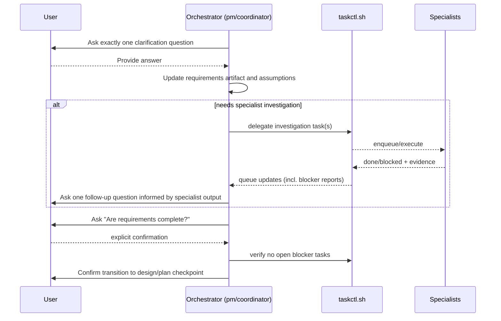

> Archival note: This spec package records the pre-extraction in-repo coordinator model. The authoritative coordinator implementation now lives in the standalone `/workspace/coordinator` repository.

# Research 02: Ralph-Plan Parity for Top-Level Orchestrator

## Objective
Define a behavior contract so the top-level orchestrator clarifies requirements with the same rigor as `ralph plan`, while still using this repo's coordination workflow.

## Required Parity Behaviors
Derived from recorded requirements:
1. Strict one-question-at-a-time clarification loop.
2. Explicit user confirmation required for phase transitions.
3. Continuous specialist task creation during clarification (not only after clarification ends).
4. Specialist outputs must feed back into new clarification questions for the user.
5. Clarification completion condition:
- user explicitly confirms requirements are complete, and
- no open blocker tasks remain.

## Proposed Orchestrator Protocol

## Gap vs Current Prompt Contracts
1. Current top-level prompt says to clarify deeply, but does not enforce single-question turns.
2. Current coordinator instructions request all required inputs "in one pass," which conflicts with adaptive iterative clarification.
3. Current prompt requires asking next-step decisions at checkpoints, but not a hard gate tied to "no blocker tasks" before exiting clarification.
4. Current setup supports delegation during clarification, but does not state that specialist findings must feed user-facing follow-up questions.

## Recommended Prompt/Instruction Changes (Design Inputs)
1. In `coordination/prompts/TOP_LEVEL_AGENT_PROMPT.md` add a clarification sub-protocol:
- ask one question per turn,
- append answer to requirement artifact before next question,
- do not ask multi-question batches.

2. Replace/adjust "Input You Need From User: Ask for this in one pass" in `coordination/COORDINATOR_INSTRUCTIONS.md` with staged elicitation:
- gather minimum context,
- then iterative one-question loop,
- delegate targeted research tasks whenever uncertainty blocks precision.

3. Add exit gate definition in top-level prompt:
- leave clarification only after explicit user confirmation and zero open blockers in `coordination/inbox/{pm,coordinator}/000` and relevant `in_progress` blocked chains.

4. Preserve continuous delegation capability:
- explicitly allow creating specialist tasks during clarification,
- require that each specialist outcome produces either (a) accepted requirement refinement or (b) one new user clarification question.

## Risks
1. Throughput slowdown from strict one-question turns.
- Mitigation: run specialist discovery tasks in parallel while keeping user interaction serial.

2. Over-delegation before scope stability.
- Mitigation: tag clarification tasks as discovery-only and prohibit implementation outputs until clarification exit gate is met.

3. Ambiguity loops from conflicting specialist input.
- Mitigation: force orchestrator to summarize conflicting evidence and ask user for one explicit decision question.

## Sources
- `specs/orchestrator-requirements-clarification/requirements.md:1`
- `specs/orchestrator-requirements-clarification/requirements.md:9`
- `specs/orchestrator-requirements-clarification/requirements.md:32`
- `specs/orchestrator-requirements-clarification/requirements.md:36`
- `coordination/prompts/TOP_LEVEL_AGENT_PROMPT.md:41`
- `coordination/prompts/TOP_LEVEL_AGENT_PROMPT.md:56`
- `coordination/prompts/TOP_LEVEL_AGENT_PROMPT.md:90`
- `coordination/COORDINATOR_INSTRUCTIONS.md:6`
