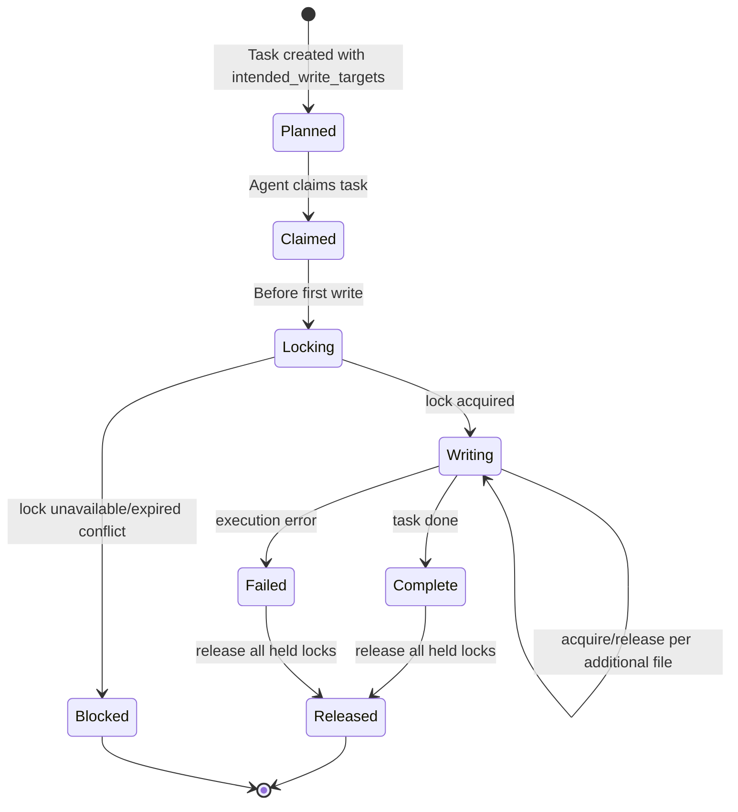
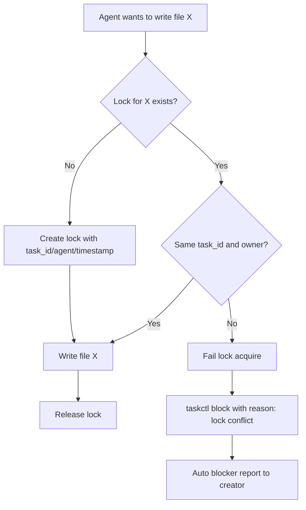

> Archival note: This spec package records the pre-extraction in-repo coordinator model. The authoritative coordinator implementation now lives in the standalone `/workspace/coordinator` repository.

# Research 03: Locking Model v1 (Option C)

## Objective
Operationalize Option C for preventing race conditions when multiple specialists might modify the same files.

## Selected Model
Hybrid (Option C):
1. Per-task ownership declaration (planned write targets) in task metadata.
2. Mandatory per-file lock acquisition immediately before write operations.
3. Lock failure routes to blocker flow instead of best-effort retries.

## Lock Lifecycle

## Data Contract Proposal (v1)
Task frontmatter additions:
- `intended_write_targets`: YAML list of workspace-relative file paths or globs.
- `lock_scope`: `file` (default for v1).
- `lock_policy`: `block_on_conflict` (default).

Lock storage:
- Directory: `coordination/locks/files/`
- One lock file per canonical target path hash.
- Lock payload fields:
  - task_id
  - owner_agent
  - canonical_target
  - acquired_at
  - heartbeat_at

## Integration Points
1. `coordination/templates/TASK_TEMPLATE.md`
- add fields for intended targets and lock defaults.

2. `scripts/taskctl.sh`
- validate `intended_write_targets` exists for code-writing specialist tasks.
- optionally provide helper command(s):
  - `lock-status <path>`
  - `lock-clean-stale`

3. `scripts/agent_worker.sh`
- add pre-write hook policy in worker prompt:
  - acquire lock before modifying each target,
  - release on completion/failure,
  - block task when lock cannot be acquired.
- support heartbeat update for long-running tasks.

## Conflict Handling

## Stale Lock Policy (v1)
1. Locks include `heartbeat_at`.
2. Worker updates heartbeat periodically while task is active.
3. A lock is stale if heartbeat exceeds configurable TTL.
4. Only orchestrator/coordinator lane may reap stale locks.
5. Reap action must be logged to `coordination/reports/` for auditability.

## Tradeoff Summary
1. Stronger than declaration-only ownership because it blocks real collisions at write time.
2. Lower operational overhead than lock-everything from task start.
3. Requires explicit task metadata discipline and worker/runtime hook updates.

## Sources
- `specs/orchestrator-requirements-clarification/requirements.md:17`
- `specs/orchestrator-requirements-clarification/requirements.md:25`
- `coordination/templates/TASK_TEMPLATE.md:1`
- `scripts/taskctl.sh:659`
- `scripts/taskctl.sh:801`
- `scripts/agent_worker.sh:217`
- `coordination/README.md:25`
